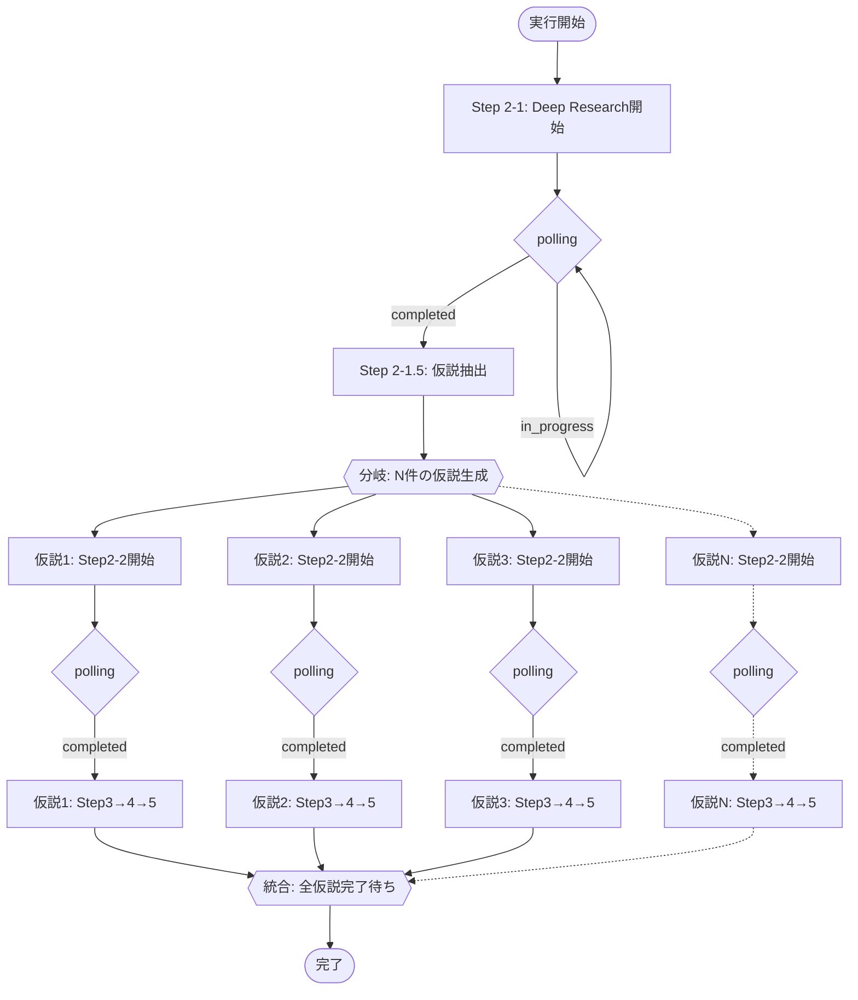
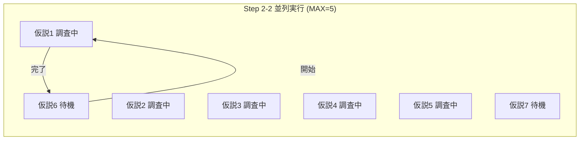
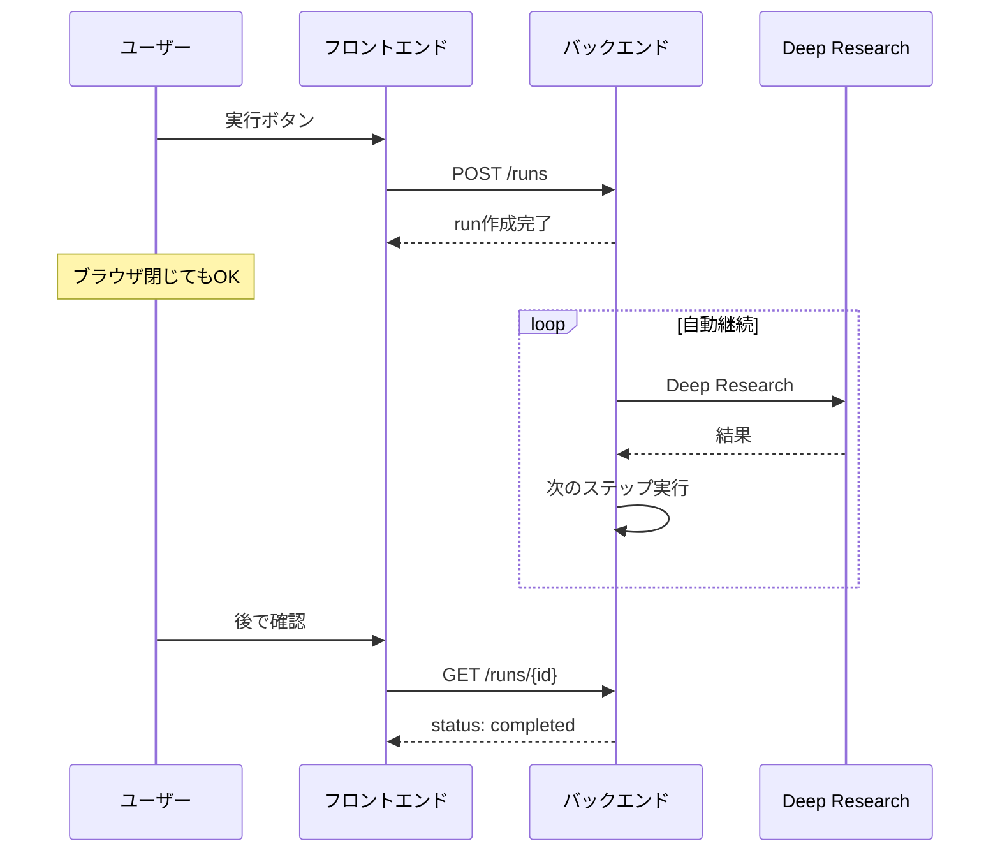
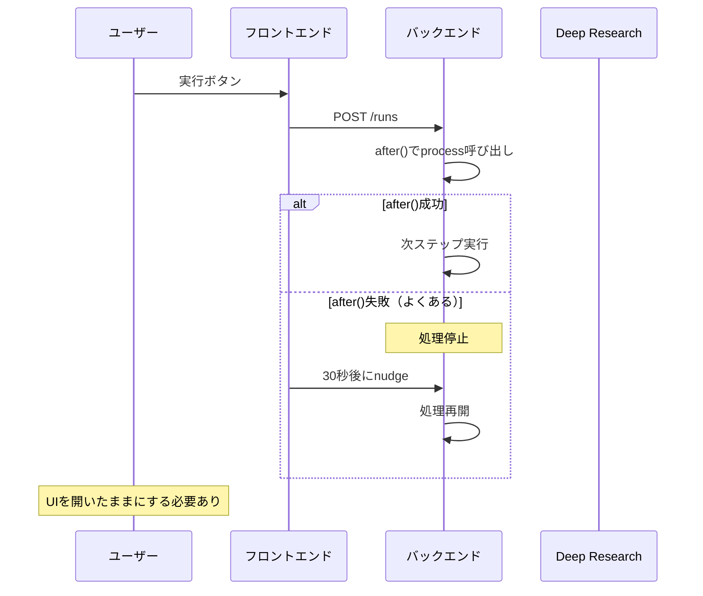

# パイプライン処理フロー

## ユーザーが求める処理フロー（分岐・統合を明示）



### 並列度の制約



## 理想: ユーザーはUIを閉じても処理が進む



## 現実: after()が不安定なため対策が必要



## 概要

ASIPパイプラインは以下のステップで構成される：
- Step 2-1: テーマ創出（Deep Research）
- Step 2-1.5: 仮説構造化抽出
- Step 2-2: 各仮説の詳細調査（Deep Research × N件並列）
- Step 3-5: 各仮説の評価（順次実行）

## アーキテクチャ

```
┌─────────────────────────────────────────────────────────────────┐
│                         Frontend (UI)                            │
│  RunProgressDisplay                                              │
│    - 30秒ごとに /api/runs/[id]/nudge を呼び出し（フォールバック）│
└─────────────────────────────────────────────────────────────────┘
                                │
                                ▼
┌─────────────────────────────────────────────────────────────────┐
│                    /api/runs/[id]/nudge                         │
│  - セッション認証                                                │
│  - 内部で /api/runs/[id]/process を呼び出し                      │
└─────────────────────────────────────────────────────────────────┘
                                │
                                ▼
┌─────────────────────────────────────────────────────────────────┐
│                   /api/runs/[id]/process                        │
│  - CRON_SECRET認証                                               │
│  - executeNextStep() をループ実行（最大50秒）                    │
│  - 高速フェーズは同期実行、低速フェーズで after() 呼び出し       │
└─────────────────────────────────────────────────────────────────┘
```

## Run開始フロー

```
1. ユーザーがUIで「実行」ボタンをクリック

2. POST /api/projects/[id]/runs
   - DBにrun作成（status: pending）
   - after() で /api/runs/[id]/process を呼び出し

3. /api/runs/[id]/process が開始
```

## Process API 詳細フロー

```
/api/runs/[id]/process 呼び出し
    │
    ▼
┌─────────────────────────────────────────┐
│ executeNextStep(deps, runId) 実行       │
│ → StepExecutionResult を返す            │
│    { phase, hasMore, error }            │
└─────────────────────────────────────────┘
    │
    ▼
┌─────────────────────────────────────────┐
│ フェーズ判定                             │
│                                         │
│ 高速フェーズの場合:                      │
│   step2_1_polling                       │
│   step2_2_polling                       │
│   step2_1_5                             │
│   evaluation                            │
│   → ループ継続（次のステップへ）         │
│                                         │
│ 低速フェーズの場合:                      │
│   step2_1_start                         │
│   step2_2_start                         │
│   → ループ終了、after() で次回呼び出し  │
│                                         │
│ 完了の場合:                              │
│   completed / error                     │
│   → ループ終了、after() 呼び出しなし    │
└─────────────────────────────────────────┘
    │
    ▼
┌─────────────────────────────────────────┐
│ ループ終了条件                           │
│ - hasMore = false（完了）               │
│ - 50秒経過（タイムアウト）              │
│ - 20回実行（安全制限）                  │
│ - 低速フェーズに到達                    │
└─────────────────────────────────────────┘
    │
    ▼
┌─────────────────────────────────────────┐
│ hasMore = true の場合                   │
│ → after() で自身を再呼び出し            │
│                                         │
│ hasMore = false の場合                  │
│ → 終了（after() 呼び出しなし）          │
└─────────────────────────────────────────┘
```

## getNextPhase() のロジック

```
getNextPhase(status, currentStep, hypotheses, progressInfo)
    │
    ├─ status が completed/error/cancelled → null（終了）
    │
    ├─ progressInfo.deepResearchHandle がある
    │  → 'step2_1_polling'（Step 2-1のDeep Research待ち）
    │
    ├─ progressInfo.hypothesisDeepResearchHandle がある（レガシー）
    │  → 'step2_2_polling'
    │
    ├─ status = 'pending'
    │  → 'step2_1_start'（Deep Research開始）
    │
    └─ status = 'running'
        │
        ├─ currentStep = 1 かつ hypotheses が空
        │  → 'step2_1_5'（仮説抽出）
        │
        └─ hypotheses を categorizeHypotheses() で分類
            │
            │  分類結果:
            │  - pending: まだ開始していない
            │  - polling: Deep Research実行中（handleあり）
            │  - readyForEval: step2_2完了、評価待ち
            │  - inEvaluation: step3-5実行中
            │  - completed: 完了
            │  - stuck: step2_2だがhandleもoutputもない
            │
            ├─ polling > 0
            │  → 'step2_2_polling'（優先: 実行中のものをチェック）
            │
            ├─ (pending + stuck) > 0 かつ polling < MAX_CONCURRENT(5)
            │  → 'step2_2_start'（新規開始）
            │
            ├─ readyForEval > 0
            │  → 'evaluation'（評価実行）
            │
            ├─ completed = 全件
            │  → 'completed'
            │
            └─ inEvaluation > 0
               → 'evaluation'（評価継続）
```

## 並列処理の詳細

### Step 2-2 (仮説調査) の並列処理

```
MAX_CONCURRENT_HYPOTHESIS_RESEARCH = 5

┌────────────────────────────────────────────────────────────────┐
│ executeStep2_2Start()                                          │
│                                                                │
│ 1. 全仮説を取得                                                │
│ 2. pending + stuck を抽出                                      │
│ 3. 現在の polling 数をカウント                                 │
│ 4. 開始可能数 = MAX_CONCURRENT - polling数                     │
│ 5. 開始可能数分の仮説に対して startDeepResearchAsync() 呼び出し│
│ 6. 各仮説の fullData.deepResearchHandle にハンドル保存         │
│ 7. progressInfo に inFlightCount, completedCount を更新       │
└────────────────────────────────────────────────────────────────┘

┌────────────────────────────────────────────────────────────────┐
│ executeStep2_2Polling()                                        │
│                                                                │
│ 1. 全仮説を取得                                                │
│ 2. fullData.deepResearchHandle を持つ仮説を抽出                │
│ 3. 各仮説に対して checkDeepResearchStatus() 呼び出し           │
│ 4. completed なら:                                             │
│    - step2_2Output に結果保存                                  │
│    - fullData.deepResearchHandle を削除                        │
│    - cleanupDeepResearch() 呼び出し                            │
│ 5. progressInfo 更新                                           │
└────────────────────────────────────────────────────────────────┘
```

## after() チェーンの問題と対策

### 問題
- Vercelのサーバーレス環境では after() がレスポンス送信後に実行される
- 関数が終了する前に after() が完了しない場合がある
- after() 内の fetch が失敗してもエラーが見えない

### 対策

1. **同期ループ実行**（現在の実装）
   - 高速フェーズはループ内で連続実行
   - after() の使用回数を最小化

2. **クライアントサイドフォールバック**
   - RunProgressDisplay が30秒ごとに /nudge を呼び出し
   - after() が失敗しても30秒以内に復帰

3. **本番環境のcron**
   - /api/cron/process-stuck-runs（本番のみ）
   - 5分ごとにスタックしたrunを検出して再開

## 典型的な実行シーケンス

```
時刻  フェーズ              処理内容
─────────────────────────────────────────────────────────
0:00  step2_1_start        Deep Research開始、after()呼び出し
      ↓ after()
0:01  step2_1_polling      ステータス確認 → in_progress
      step2_1_polling      ステータス確認 → in_progress
      ...（ループ継続、最大50秒）
      step2_1_polling      ステータス確認 → completed
      step2_1_5            仮説抽出（5件生成）
      step2_2_start        5件同時にDeep Research開始、after()呼び出し
      ↓ after()
0:02  step2_2_polling      5件のステータス確認
      step2_2_polling      5件のステータス確認
      ...（ループ継続）
      step2_2_polling      3件completed、2件in_progress
      step2_2_polling      4件completed、1件in_progress
      step2_2_polling      5件completed
      evaluation           仮説1のstep3実行
      evaluation           仮説1のstep4実行
      evaluation           仮説1のstep5実行 → 仮説1完了
      evaluation           仮説2のstep3実行
      ...
      evaluation           仮説5のstep5実行 → 仮説5完了
      completed            全完了
```

## 環境変数

| 変数名 | 用途 |
|--------|------|
| CRON_SECRET | process API の認証 |
| VERCEL_AUTOMATION_BYPASS_SECRET | Vercel Protection バイパス |
| VERCEL_URL | 自己呼び出し用URL（自動設定） |
| GOOGLE_GENAI_API_KEY | Gemini API |
